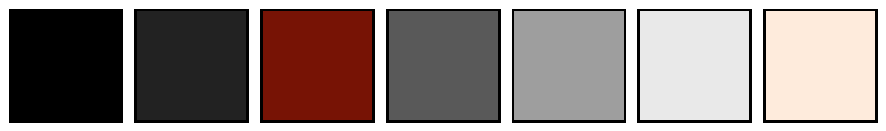
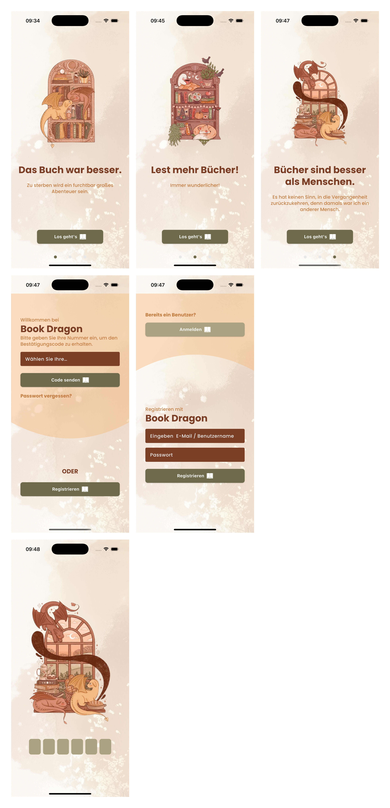

<a name="readme-top"></a>

<!-- Top Links Bar -->

[![LinkedIn][linkedin-shield]][linkedin-url]
[![X][x-shield]][x-url]
[![Instagram][instagram-shield]][instagram-url]

<!-- PROJECT LOGO -->
<br />
<div align="center">
  
  <h1 align="center">Color Palette Generator</h1>
  </div>

<!-- PROJECT desc -->
  <p align="left">
Generates a color palette image from my `Flutter` hexcolors for the README.md of my projects

### Requirements

- `pillow`

### run scrip examples to generate color pallete

```sh
python3 color_palette.py 0xFF793e25 0xFF935f46 0xFFbf793d 0xFFf6bd88 0xFF6D6A4B 0xFFaaa27e 0xFF915d52 0xFFf8fdf9
```

### Example



### run scrip examples to generate final layout image

To create the layout image, you must name your images as follows:

#### First row:

- `1_1.png`, `1_2.png`, `1_3.png`, ...

#### Second row:

- `2_1.png`, `2_2.png`, `2_3.png`, ...

#### Third row:

- `3_1.png`, `3_2.png`, `3_3.png`, ...

The images must be in the **same folder** as your script.

```sh
python3  python3 final_layout.py
```

### Example



### Sources

- [Login Layout Inspo](https://github.com/gerfagerfa/login_and_signup)
- [Images](https://www.marigonasuli.com/)

[bloc]: https://img.shields.io/badge/Bloc-8B0000.svg?style=for-the-badge&logo=bloc&logoColor=white
[bloc-url]: https://pub.dev/packages/bloc
[dart]: https://img.shields.io/badge/Dart-%230175C2.svg?style=for-the-badge&logo=dart&logoColor=white
[dart-url]: https://dart.dev/
[dio]: https://img.shields.io/badge/Dio-FE5000.svg?style=for-the-badge&logo=internet-explorer&logoColor=white
[dio-url]: https://pub.dev/packages/dio
[dartz]: https://img.shields.io/badge/Dartz-1C4E80.svg?style=for-the-badge&logo=dart&logoColor=white
[dartz-url]: https://pub.dev/packages/dartz
[equatable]: https://img.shields.io/badge/Equatable-32CD32.svg?style=for-the-badge&logo=equatable&logoColor=white
[equatable-url]: https://pub.dev/packages/equatable
[firebase]: https://img.shields.io/badge/Firebase-039BE5?style=for-the-badge&logo=Firebase&logoColor=white
[firebase-url]: https://firebase.google.com/
[flutter]: https://img.shields.io/badge/Flutter-%2302569B.svg?style=for-the-badge&logo=flutter&logoColor=white
[flutter-url]: https://flutter.dev/
[flutter-bloc]: https://img.shields.io/badge/Flutter%20Bloc-2E86C1.svg?style=for-the-badge&logo=flutter&logoColor=white
[flutter-bloc-url]: https://pub.dev/packages/flutter_bloc
[flutter-screenutil]: https://img.shields.io/badge/Flutter%20ScreenUtil-blue.svg?style=for-the-badge&logo=flutter&logoColor=white
[flutter-screenutil-url]: https://pub.dev/packages/flutter_screenutil
[flutter-localizations]: https://img.shields.io/badge/Flutter%20Localizations-0170F3.svg?style=for-the-badge&logo=flutter&logoColor=white
[flutter-localizations-url]: https://flutter.dev/docs/development/accessibility-and-localization/internationalization
[flutter-secure-storage]: https://img.shields.io/badge/Flutter%20Secure%20Storage-2F4F4F.svg?style=for-the-badge&logo=lock&logoColor=white
[flutter-secure-storage-url]: https://pub.dev/packages/flutter_secure_storage
[get-it]: https://img.shields.io/badge/GetIt-007ACC.svg?style=for-the-badge&logo=getit&logoColor=white
[get-it-url]: https://pub.dev/packages/get_it
[http]: https://img.shields.io/badge/HTTP-007BFF.svg?style=for-the-badge&logo=http&logoColor=white
[http-url]: https://pub.dev/packages/http
[hive]: https://img.shields.io/badge/Hive-FFB300.svg?style=for-the-badge&logo=hive&logoColor=white
[hive-url]: https://pub.dev/packages/hive
[injectable]: https://img.shields.io/badge/Injectable-009688.svg?style=for-the-badge&logo=injectable&logoColor=white
[injectable-url]: https://pub.dev/packages/injectable
[intl]: https://img.shields.io/badge/Intl-FFA500.svg?style=for-the-badge&logo=dart&logoColor=white
[intl-url]: https://pub.dev/packages/intl
[instagram-shield]: https://img.shields.io/badge/Instagram-%23E4405F.svg?style=for-the-badge&logo=instagram&logoColor=white
[instagram-url]: https://www.instagram.com/codeincouture/
[license-shield]: https://img.shields.io/badge/License-MIT-%23000000.svg?style=for-the-badge&logo=license&logoColor=white
[license-url]: https://github.com/othneildrew/Best-README-Template/blob/master/LICENSE.txt
[linkedin-shield]: https://img.shields.io/badge/LinkedIn-%230A66C2.svg?style=for-the-badge&logo=linkedin&logoColor=white
[linkedin-url]: https://www.linkedin.com/in/tanja-polz-5636401a5/
[mappable]: https://img.shields.io/badge/Dart%20Mappable-008080.svg?style=for-the-badge&logo=dart&logoColor=white
[mappable-url]: https://pub.dev/packages/dart_mappable
[mockapi]: https://img.shields.io/badge/MockAPI-9cf.svg?style=for-the-badge&logo=api&logoColor=white
[mockapi-url]: https://mockapi.io/projects
[mocktail]: https://img.shields.io/badge/Mocktail-blue.svg?style=for-the-badge&logo=dart&logoColor=white
[mocktail-url]: https://pub.dev/packages/mocktail
[very-good]: https://img.shields.io/badge/Very%20Good%20Analysis-B22C89.svg?style=for-the-badge&logo=verygood&logoColor=white
[very-good-url]: https://pub.dev/packages/very_good_analysis
[x-shield]: https://img.shields.io/badge/-%23000000.svg?style=for-the-badge&logo=x&logoColor=white
[x-url]: https://twitter.com/_foxnoir_?lang=de
